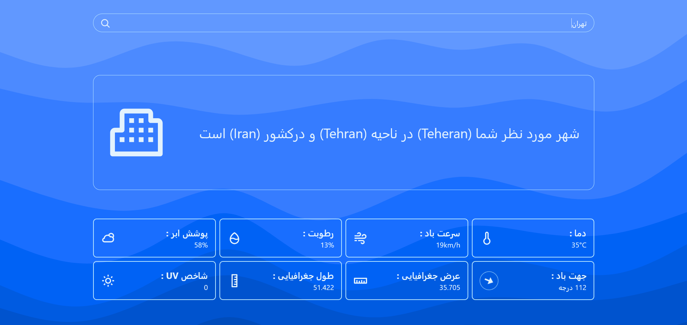

# 🌤️ Weather App

A modern, responsive weather application built with vanilla JavaScript and Tailwind CSS .
Search any city in the world and get real-time weather data — displayed with a clean, RTL-friendly UI.

> Powered by the free [wttr.in](https://wttr.in) API — **no API key required**.

---

## ✨ Features

- 🔍 Search weather for any city worldwide
- 🌡️ Real-time data: temperature, humidity, wind speed, cloud cover & UV index
- 🧭 Animated wind direction indicator
- 📱 Fully responsive — mobile, tablet & desktop
- 🆓 No API key or registration needed

---

## 📸 Screenshot

<!-- 👇 Place your screenshot at ./assets/screenshot.png 👇 -->

---
